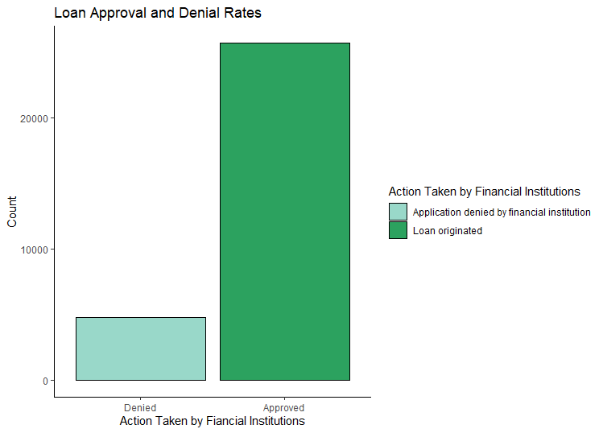
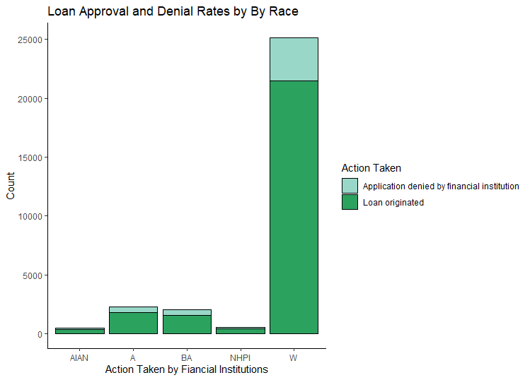
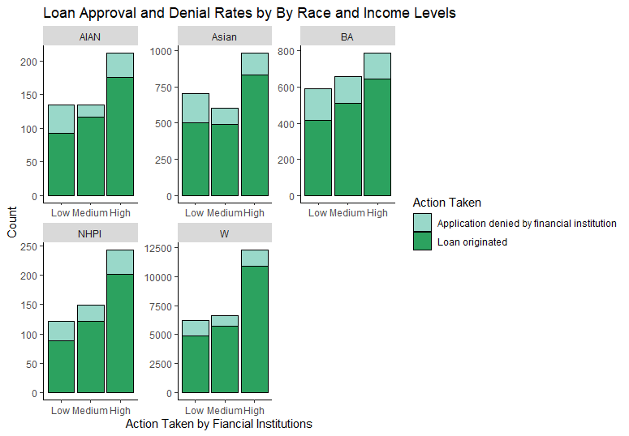

```{r setup, include=FALSE}
knitr::opts_chunk$set(message=FALSE,warning=FALSE, cache=TRUE)
```


# 1:Introduction
In the recent past, minorities in Tacoma, Washington were denied access to home loans based on where they lived. This practice is known as redlining because property assessors would create maps with minority communities outlined in red. The red outline told bankers minority communities were not fit for loans. The consequence of redlining was a significant disparity in mortgage loans and homeownership rates between white communities and minority communities.

Today, banks don’t practice redlining, but disparities in mortgage loans and homeownership still exist at a significant rate. For example, the average homeownership rate in the West Census Region is 59.3 %. However, the average homeownership rate for minorities (47.9 %) is 11.4 points below the West Census Region's average and 25.2 points below their white peers (73.1 %).

Homeownership is an effective wealth generating tool. According to a study conducted by the Demos organization, if disparites in homeownership rates were closed; the wealth gap between white and black families decreased by 31 %. Because of these circumstances, an analysis of home mortgage data to discover patterns in loan approval / denial rates in the Tacoma-Lakewwood area is warranted.


## 1.1: Data
Analysis began by gathering data from the Consumer Financial Protection Bureau (CFPB). The CFPB provides access to loan-level data so that trends in mortgage applications can be monitored. Action taken on loan applications, HUD median income, loan amount, appliancts income, race and ethnicity, gender, loan type and purpose are some of the variables that are included in the dataset from the CFPB. For this analyses, the mortgage dataset included 30,451 observations for the Tacoma-Lakewood area, of which 85 % of the applicants were approved for mortgages. 

## 1.2: Methods
To guide the modeling approach, the process began with the assumption that minority approval rates are lower than non-minorites when controlling for loan amount,income and other factors. This hypothesis was based on trends in homeownership rates. Furthermore, logistic regression was used to generate the odds of approval for a mortgage loan based on race.

# 2: Exploratory Analysis
Exploratory analysis was used to understand what factors are related to different statuses on action taken by the financial institution (loan originated or loan denied).

## 2:1 Exploratory Analysis of Categorical Variables

Applicant_sex,applicant_race, and action_taken were used to conduct a series chi-square test to determine if any significant differences in loan status existed. The full [tables] and the results of the significance test are included in the Appendix here. As an example, test were conducted a to determine whether the loan approvals and denials for minorities were significantly different from non-minoirties. Figure 1 shows the overall approval and denial rates for mortgage loans, of which roughly 85 % were approved and 15 % denied.

### Figure 1



## 2:2 Exploratory Analysis by Race and Loan Status
After observing the overall breakdown of loan approvals and denials, the analysis focused on the distribution of loan approvals and denials across race. The chi-square results indicated a significant relationship between between race and action taken by financial institution. The [tables] in the appendix show that minorites have an average approval probability for loan approval of 79%, which is roughly 6 points lower than non-minorities. In terms of an odds ratio, non-minorities have a 5.91 to 1 chance of receiving approval; and minorities have 3.79 to 1 chance of receiving approval, which is 64 % less than non-minorities.

### Figure 2



## 2:3
To drill down into the data further, applicant's income was placed into low, medium, and high categories. Less than $ 60,000 was considered low, income between 60,000 and 113,000 dollars was labeled medium, and greater than 113,000 dollars was considered high.Figure 3 shows loan approval for minorities with low, medium, and high incomes visibly different than non-minorities. For example, the three way cross table indicated that minorites with low income have an average probability of 70.5 % to receive a loan approval, while non-minorities a 78.7 % chance to get a loan. Further more, when controlling for high income, minorities have an 82.7 % chance to obtain a loan, and non-minorities an 88.6 % probability of receiving a loan.




# 3: Data Screening and Processing
The data wrangling process began by checking for errors, missing data, outliers, and testing assumptions. The table function in R was used to examine categorical variables for miscoded data and mislabeled categories. Fortunately, there were no issues with categorical variables. Next, the summary function identified which continuous variables had missing values. The variable applicant_income_000s had 1306 missing values. To solve this problem, an imputation function imputed values to the missing data. Once that problem was solved, graphical analysis and test of normality indicated that the variables applicant_income_000s and loan_amount_000s had to be transformed to reduce skewness. The log transformation succesfully completed this task. And lastly, categorical variables were converted to binary variables.

# 4: Modeling
Often, models are used to understand how an independent variable affects a dependent variable. In this situation, logistic regression was used to determine if the odds for loan approval was different for non-minorities and minorities when income and loan amount are equal. 

## 4:1 Results
The [logistic regression] revealed that minorites have a lower odds for approval than non-minorities when seeking a morthage loan. For example, when controlling for average income and average loan amount, a white person's odds for loan approval is 5.93 to 1; and a black person's odds are 3.75 to 1. These results are analogous to the results obtained from the contingency tables mentioned in the exploratory analysis section. The formula used to derive the odds ratios from the logistic regression is provide in the appendix

# 5: Appendix
## tables
```{r echo=FALSE}
tac<-read.csv("Tacoma.csv",header = T)
table(tac$action_taken_name,tac$applicant_race_name_1)
(tab2<-table(tac$action_taken_name,tac$applicant_race_name_1))
rowSums(tab2)
colSums(tab2)
prop.table(table(tac$action_taken_name,tac$applicant_race_name_1))*100
prop.table(table(tac$action_taken_name,tac$applicant_race_name_1),margin = 2)*100
(tab3<-prop.table(table(tac$action_taken_name,tac$applicant_race_name_1),margin = 2)*100)


```
The chi squared test was used to determine if their is a significant relationship between race and loan action taken by financial institutions.
```{r echo=FALSE}
chisq.test(tac$action_taken_name,tac$applicant_race_name_1)
```


## 5:1 R Packages Used
```{r echo=TRUE}
tac<-read.csv("Tacoma.csv",header = T)
library(MASS)
library(caret)
library(car)
library(ggplot2)
library(dplyr)
library(pastecs)
library(psych)
library(QuantPsyc)
```


## 5:2 Imputation of Missing Values
```{r echo=TRUE}
tac$missing_inc<-ifelse(is.na(tac$applicant_income_000s),
                      "Y","N")
names(tac)
features_1<- c("tract_to_msamd_income","population","minority_population",
               "loan_amount_000s","applicant_income_000s","applicant_race_name_1",
               "applicant_sex_name", "action_taken_name")
tac<-tac[,features_1]
dummy_vars<- dummyVars(~., data = tac[,-8])
tac_dummy<- predict(dummy_vars,tac[,-8])
View(tac_dummy)
names(tac_dummy)
pre_process<- preProcess(tac_dummy, method = "medianImpute")
imputed_data<-predict(pre_process,tac_dummy)
View(imputed_data)

tac$applicant_income_000s<- imputed_data[,5]
summary(tac$applicant_income_000s)
```


## 5:3 Transformations
```{r echo= TRUE}
tac<- mutate(tac, log_income = log(applicant_income_000s) )
tac<- mutate(tac, log_LA = log(loan_amount_000s) )
summary(tac$log_LA)
summary(tac$log_income)
describe(tac$log_income)
hist(tac$log_income)
describe(tac$log_LA)
hist(tac$log_LA)
```


## 5:4 Feature Engineering

``` {r echo = TRUE}
tac$BA[tac$applicant_race_name_1=="Black or African American"]="1"
tac$BA[tac$applicant_race_name_1=="American Indian or Alaska Native"]="0"
tac$BA[tac$applicant_race_name_1=="White"]="0"
tac$BA[tac$applicant_race_name_1=="Asian"]= "0"
tac$BA[tac$applicant_race_name_1 == "Native Hawaiian or Other Pacific Islander"]= "0"
tac$Loan_Status[tac$action_taken_name=="Application denied by financial institution"]="0"
tac$Loan_Status[tac$action_taken_name=="Loan originated"]="1"
View(tac)
tac<-mutate(tac, Female = ifelse(applicant_sex_name =="Female",1,0))
tac<-mutate(tac, AIAN = ifelse(applicant_race_name_1=="American Indian or Alaska Native",1,0))
tac<-mutate(tac, Asian = ifelse(applicant_race_name_1=="Asian",1,0))
tac<-mutate(tac, NHPI = ifelse(applicant_race_name_1=="Native Hawaiian or Other Pacific Islander",1,0))
tac$Loan_Status<- as.factor(tac$Loan_Status)
tac$BA<-as.factor(tac$BA)
tac$Female<-as.factor(tac$Female)
tac$AIAN<-as.factor(tac$AIAN)
tac$Asian<-as.factor(tac$Asian)
tac$NHPI<-as.factor(tac$NHPI)
str(tac)
table(tac$action_taken_name,tac$applicant_race_name_1)
table(tac$Female)
names(tac)
tac<- tac[,c(1,2,3,9,10,11,12,13,14,15,16)]
View(tac)
```

## 5:5 Data Partitioning

```{r echo= TRUE}
set.seed(327)
index <- createDataPartition(tac$Loan_Status, p = 0.7, list = FALSE)
train<-tac[index,]
test<-tac[-index,]
train_control<- trainControl(method = "repeatedcv", 
                             number = 10, 
                             repeats = 10, 
                             verboseIter = FALSE,                             
                             sampling = "smote")
```


## 5:6 Model Output
### logistic regression
```{r echo = TRUE}
model1<-glm(Loan_Status~ log_income+log_LA+BA+Female+AIAN+Asian,data = train,
            family ="binomial")
summary(model1)
```


## 5:7
### table


